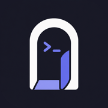

<p align="center">
  
</p>

<p align="center">
  <a href="https://www.getanyssh.com">Website</a> &nbsp;&middot;&nbsp;
  <a href="https://apps.apple.com/app/anyssh">Download</a> &nbsp;&middot;&nbsp;
  <a href="#features">Features</a> &nbsp;&middot;&nbsp;
  <a href="#getting-started">Getting started</a>
</p>

---

# AnySSH

An iOS SSH client for working on your own machines from a phone or an iPad: a real terminal, the git changes on the host, the files behind them, and whatever tmux or herdr session is already running there.

There is no backend, no account, and nothing to install on the host. Every signal the app shows is derived from ordinary commands over SSH, and keys and passphrases live in the iOS Keychain on the device.

## Features

- **Terminal.** SwiftTerm engine behind a UIKit host, with an accessory bar, a modifier latch, gestures, hardware-keyboard support, and OSC 52 clipboard in both directions.
- **Sessions.** A session registry with surface ownership, cancellation, a scrollback budget under memory pressure, reconnect with honest copy about iOS backgrounding, and restore across a cold launch.
- **Remotes.** Host list, key import, host-key trust prompts, biometric gating, and reachability.
- **Git.** Changes and history read from the host, with a diff renderer and tree-sitter syntax highlighting.
- **Files.** A remote file browser with viewers for source, JSON, Markdown, images, SVG, and video, plus image and file paste back to the host.
- **Multiplexers.** tmux and herdr adapters, topology, and attach.
- **Alerts.** Local job-finish notifications and a Live Activity fed by the open connection.

## Requirements

- Xcode 26.x with the iOS 26 SDK and an iOS 26 simulator runtime
- The Metal Toolchain (`xcodebuild -downloadComponent MetalToolchain`), which SwiftTerm needs
- An Apple Developer team only for device builds; simulator work needs no signing

## Getting started

```bash
cp .env.example .env
make vendor
make run
```

`make vendor` builds the pinned libssh2 + OpenSSL xcframework once; it is gitignored and reproduced from pins. `make run` boots a simulator and launches the app in mock mode, where `AnySSHMocks` implements every port and the whole app runs with no live host.

### Configuration

| File | Read by | Holds |
|---|---|---|
| `.env` | `Makefile`, `Scripts/` | Simulator names, bundle id, device UDID |
| `Config/Local.xcconfig` | Xcode | `DEVELOPMENT_TEAM` for device builds |

Both are gitignored and neither holds a secret: the app ships no API keys and asks for no service credentials.

## Project layout

```
AnySSH/                 app target: composition root, wiring, launch scenarios
AnySSHWidgets/          widget and Live Activity extension
AnySSHUITests/          XCUITest flows
Shared/                 types compiled into both the app and the extension
Packages/AnySSHKit/     all modules, tests, and fixtures
Config/                 xcconfig build settings and Info.plists
Scripts/                build and vendoring automation
```

`AnySSHKit` is where the work happens: `AnySSHCore` declares the ports and value types; the adapter modules (`SSHTransport`, `TerminalEmulator`, `Highlighting`, `GitClient`, `FileTransfer`, `Sessions`, `Multiplexers`) implement them without importing each other; `AnySSHUI` is the only target that sees SwiftTerm, and its `Components/` folder is the single source of visual truth.

## Development

| Target | What it does |
|---|---|
| `make doctor` | Verify the toolchain and repair the SDK to runtime mapping |
| `make vendor` | Build the pinned libssh2 + OpenSSL xcframework |
| `make build` | Build the app for the simulator |
| `make test` | Tier 1: pure logic on the host, no simulator |
| `make test-sim` | Tier 2: package tests on the simulator |
| `make ui-test` | Tier 3: the XCUITest flows in `AnySSHUITests` |
| `make lint` | swift-format, the 300-line budget, the comment ban, module import rules |
| `make format` | Rewrite sources in place |
| `make run` | Boot, install, and launch in mock mode |
| `make screenshot` | Capture a mock-mode screenshot headlessly, `SCENARIO=<name>` |

The project holds three targets: `AnySSH` (the app), `AnySSHWidgets` (the widget and Live Activity extension, embedded and signed by the app), and `AnySSHUITests` (the XCUITest bundle, run through the `AnySSH` scheme). Every screen is reachable headlessly through `ANYSSH_SCENARIO=<name>`, which is how both the UI tests and the screenshot sweep get to a state without tapping.

CI runs `swift-format` and the line budget on every push. The design system, module boundaries, and commit conventions are defined in [AGENTS.md](AGENTS.md) and are binding for every contributor.

## Security

The SSH transport is libssh2 with OpenSSL, vendored as an xcframework and built on demand from a pinned commit rather than a release tarball. The vendoring script refuses to build any commit that does not descend from the fix for CVE-2026-55200, because a malicious server is the threat model.
